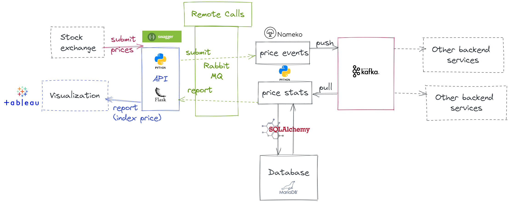

# PoC of events based application with Nameko, Kafka and Flask

## Architecture

### Services

- `API (flask)`:
  - Make RPC calls to nameko services `priceevents` and `pricestats`.
  - Endpoints are synchronous.
  TODO: They should be asynchronous and return a 202.
- `priceevents`(nameko service):
  - exposes a RPC endpoint to submit event messages to kafka.
- `pricestats` (nameko service):
  - consumes messages from kafka
  - insert a new record into a sqlite database for each new price event

### Database
- Used sqlite

### Brokers

- Zookeeper: Required by kafka
- Kafka: Messages
- Rabbit: Communication between services

## Run demo with docker compose

1. Run brokers with `docker-compose up --build broker rabbit zookeeper`. Wait until they are ready (around 30 s).
2. In a separate terminal, run the services: `docker-compose up --build priceevents pricestats api`
3. Submit new 10 prices: `curl localhost:8000/submit/10`. Number of new prices can be any integer.
4. Request a new price indext at timestamp 2 with `curl localhost:8000/report/2`

## Automatic tests

Created a couple of tests for each service. Run `docker-compose run --entrypoint=bash priceevents /var/price_events/run-tests.sh`
  
## Local development env

Developement enviroment can be created with `pipenv install`

## "TODO"

- Improve exception handling in database queries and communication with kafka
- Add more unit test to increase coverage. Only one test has been included.
